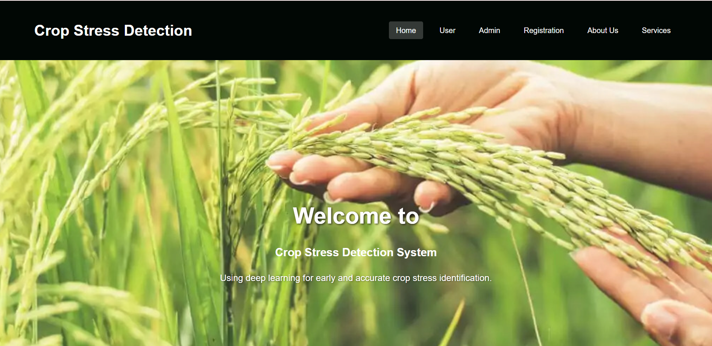
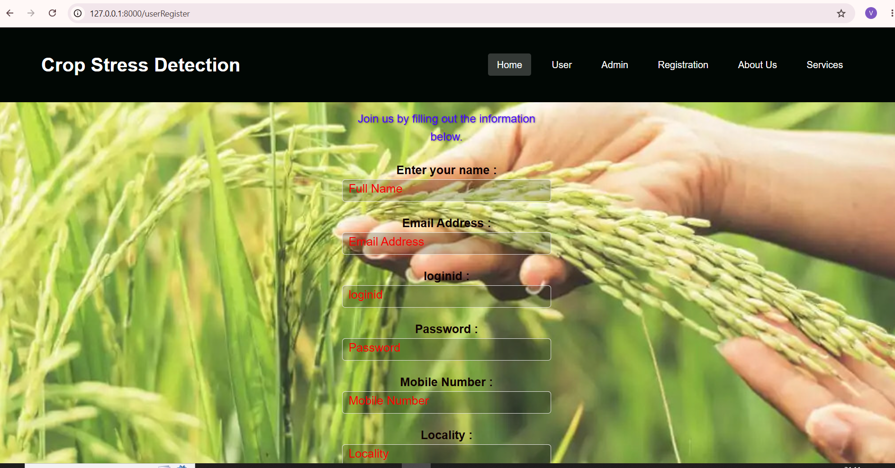

# Crop-Stress-Detection
A Deep Learning and Django-based web application for crop stress detection and plant health analysis using image classification techniques.

## Features

- User Registration and Login
- Crop Image Upload
- Deep Learning-Based Crop Stress Detection
- Plant Health Analysis
- Prediction Results Dashboard
- Admin Management Panel
- User-Friendly Interface

## Technologies Used

- Python
- Django
- TensorFlow
- Keras
- HTML
- CSS
- SQLite

## Project Structure


Crop-Stress-Detection/
│
├── Admin/
├── Users/
├── templates/
├── media/
├── manage.py
├── README.md
└── .gitignore


## Installation

### Clone Repository

bash
git clone https://github.com/VeerababuJaddu/Crop-Stress-Detection.git


### Install Dependencies

bash
pip install -r requirements.txt


### Run Database Migrations

bash
python manage.py migrate


### Start Development Server

bash
python manage.py runserver


### Open Browser

```text
http://127.0.0.1:8000/
```

## Dataset

The crop stress dataset contains the following classes:

- BLB (Bacterial Leaf Blight)
- Blast
- Healthy
- Hispa
- Leaf Spot

Dataset Link: [Google Drive Dataset](https://drive.google.com/drive/folders/1FDRzB-tTPfhogVK73LSHKfZ-JqiBKPDD?usp=sharing)

## Screenshots

### Home Page


### Login Page


### Registration Page


### Prediction Page


## Prediction Results

### BLB Prediction Result


### Blast Prediction Result


### Healthy Prediction Result


### Hispa Prediction Result


### Leaf Spot Prediction Result


### Admin Dashboard


## Future Enhancements

- Real-time Crop Monitoring
- Mobile Application Integration
- Multiple Crop Disease Detection
- Cloud Deployment

## Author

*Veerababu Jaddu*

GitHub: https://github.com/VeerababuJaddu
